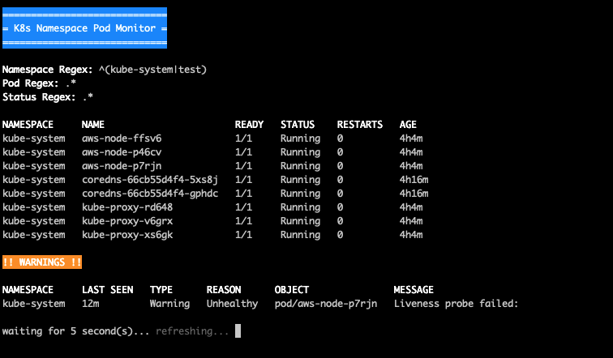

# Kubernetes Namespace Pod Monitor
Kubernetes CLI tool that monitors pods for specified namespace, pod, or status regex filters. Useful when monitoring deployments across multiple namespaces.

## About
When deploying pods in Kubernetes, it can be cumbersome to determine if all pods have entered a successful state or not. Adding the `-w` flag to a simple `kubectl get po -n "test1"` command only appends any changes to the CLI stdout and doesn't give a clear picture of what pods are in what statuses.

This tool will help visualize those pod statuses and can do so across multiple namespaces, as well as filter by pod name and status. Additionally, any `Warning` events that are being reported will display as well, giving an all-in-one stop for K8s information.

Originally written for use with EKS clusters, the tool uses native `kubectl` and will work on most K8s clusters.

---

## Prerequisites

- Bash compatible terminal
- Kubectl installed and configured to communicate with your EKS cluster `*`
- A working K8s cluster (see [Creating Demo Cluster and Resources](#creating-demo-cluster-resources) if you need to create one)

`* See the resources section for how-to assistance`

## Resources
The below resources pertain to AWS EKS and include instructions for configuring your machine to communicate with EKS, as well as how to create & utilize an EKS cluster.

- [Installing & Configuring AWS CLI (create cluster)](https://docs.aws.amazon.com/cli/latest/userguide/cli-chap-configure.html)
- [Installing & Configuring Eksctl (create cluster)](https://docs.aws.amazon.com/eks/latest/userguide/eksctl.html)
- [Installing & Configuring Kubectl for EKS (communicate with cluster)](https://docs.aws.amazon.com/eks/latest/userguide/create-kubeconfig.html)

If you are looking for a guide on how to configure kubectl to communicate with a non-EKS server, see K8s documentation:

- [Install & Set Up Kubectl On Linux](https://kubernetes.io/docs/tasks/tools/install-kubectl-linux/)
- [Install & Set Up Kubectl On MacOS](https://kubernetes.io/docs/tasks/tools/install-kubectl-macos/)

---

## Usage

Script is designed to be ran on local machine via CLI. Simply execute the bash script and provide namespace(s).

To see the script in action, follow the example usage instructions below. If you need to set up a test cluster first, follow the "[Creating Demo Cluster & Resources](#creating-demo-cluster--resources)" instructions. 

---

### Creating Demo Cluster & Resources
This is optional, but provides a working cluster if you need to test the script. It is broken into two parts. Depending on your needs, follow the corresponding sections.

#### Creating An EKS Cluster & Node Group
Creating a demo EKS cluster requires an AWS account and the tooling defined below. The creation of the cluster itself is a single command (manifest included in examples) and will result in `kubectl` automatically configured to communicate with your cluster once complete.

##### Tooling Required
See [Resources](#resources) section for assistance with accomplished these.
- IAM permissions to create an EKS cluster
- AWS CLI installed and configured
- Eksctl installed
- Kubectl installed

##### Commands To Create The Cluster

All commands below should be executed in a Bash compatible terminal from the repository root. You'll also want to update `examples/cluster.yaml` if you need to deploy into a region other than `us-east-1`. The commands below will either create or delete the cluster (depending on your needs).

- Create: `eksctl create cluster -f examples/cluster.yaml`
- Delete: `eksctl delete cluster -f examples/cluster.yaml` (when completed with testing)

_Creation can take upwards 15 minutes or more._

#### Creating & Deleting Kubernetes Resources
This will provision two namespaces with a deployment in each. Each deployment has a pod with a container scaled to 3 instances.

All commands below should be executed in a Bash compatible terminal from the repository root.

1. Create two test namespaces, and the corresponding deployment with pods/containers: `kubectl apply -f examples/resources.yaml`
2. Run the script to see the statuses of pods in each namespace (see [Example Script Execution](#example-script-execution))

---

### Example Script Execution
You'll want to first make sure the script is executable, otherwise you'll see errors about the file not existing:

`chmod +x monitor.sh;`

To execute, simply call from command line like you would any Bash script:

`./monitor.sh`

Namespace, pod, and regex filters allow you to use a wide range of regex syntax. Essentially, if `AWK` supports it, it will work. The filtering is hierarchical in the following order:

- namespace (`-n`)
- pod (`-p`)
- status (`-s`)

For example, if you apply a namespace and pod filter, the namespace filter is applied first, _then_ the pod filter.

#### Getting Pods In Namespaces "test1" and "test2"
`./monitor.sh -n "^(test1|test2)$"`

#### Filtering For Pods That Contain "kube-proxy"
`./monitor.sh -p "kube-proxy"`

#### Filtering For Pods In Pending Status
`./monitor.sh -s "^Pending$"`

### All Parameters

|Parameter|Type|Required?|Purpose|
|---|---|---|---|
|-n|string|no|Namespace regex to search. Must be a valid regex statement. Example: "test1\|test2"|
|-p|string|no|Pod regex to search. Must be a valid regex statement. Example: "^test"|
|-s|string|no|Status regex to search. Must be a valid regex statement. Example: "Backoff"|
|-w|integer|no|Amount of seconds to wait before querying the K8s cluster again. Default is 5.|
|-v|switch|no|Optional flag to show verbose warnings from the cluster.|
|-h|switch|no|Displays script usage information.|